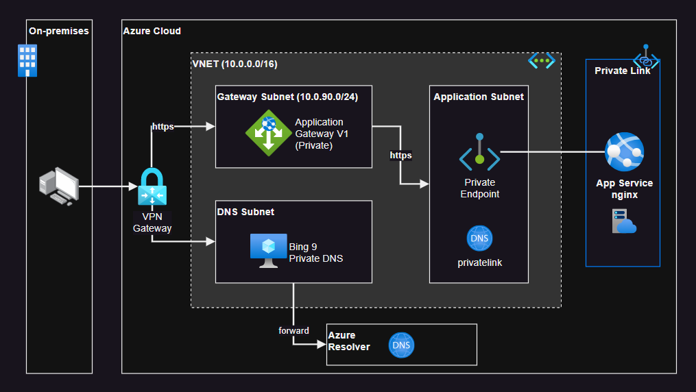

# Azure App Service + Custom DNS private network

Demonstration of a private App Service (via Private Link) with a Bind 9 private DNS throught a VPN channel.

> Application Gateway V2 can be configured for private IP only using [these instructions](https://learn.microsoft.com/en-us/azure/application-gateway/application-gateway-faq#how-do-i-use-application-gateway-v2-with-only-private-frontend-ip-address)



## 1 - Create the infrastructure

Set up the private key for the VMs:

```sh
mkdir -p .keys
ssh-keygen -f .keys/tmp_rsa
```

Create the Azure resources:

```sh
terraform init
terraform apply -auto-approve
```

Build and push the application to ACR:

```sh
cd app
bash acrBuildPush.sh "<ACRNAME>"
```

Copy the TF output command and log into the virtual machine:

```sh
ssh dnsadmin@<IP>
```

In a production environment this DNS server wouldn't have a public IP, but for the purposes of this demo I'll do that.

Allow a moment for cloud-init to run the `init.sh` commands and prepare the installation of the Bind 9. To debug any issues with cloud-init look into `/var/log/cloud-init-output.log`.

```
sudo systemctl status named
```

Also confirm that the App Service Private Endpoint is working:

```
dig +short app-myprivateapp.azurewebsites.net
curl https://app-myprivateapp.azurewebsites.net
```

After that, it's a good idea to reboot the VM as the kernel might have been upgraded:

```
az vm restart -g rg-myprivateapp -n vm-dns-myprivateapp
```

## 2 - Setup the DNS Zone

Connect again to the VM and confirm that Bind 9 is running:

```
sudo systemctl status named
```

Configure the `/etc/bind/named.conf.options` to be somewhat like this:

```
options {
        directory "/var/cache/bind";

        // If there is a firewall between you and nameservers you want
        // to talk to, you may need to fix the firewall to allow multiple
        // ports to talk.  See http://www.kb.cert.org/vuls/id/800113

        // If your ISP provided one or more IP addresses for stable
        // nameservers, you probably want to use them as forwarders.
        // Uncomment the following block, and insert the addresses replacing
        // the all-0's placeholder.

        forwarders {
                // Azure DNS
                168.63.129.16;
        };

        allow-query { any; };

        //========================================================================
        // If BIND logs error messages about the root key being expired,
        // you will need to update your keys.  See https://www.isc.org/bind-keys
        //========================================================================
        dnssec-validation auto;

        auth-nxdomain no;    // conform to RFC1035
        recursion yes;

        listen-on-v6 { any; };
};
```

Add your domain zone to the `/etc/bind/named.conf.local` file:

```
zone "myzone.internal" {
        type master;
        file "/etc/bind/db.myzone.internal";
        notify no;
};
```

Copy a template for the zone configuration:

```
sudo cp /etc/bind/db.local /etc/bind/db.myzone.internal
```

Edit the `/etc/bind/db.myzone.internal` to look like this:

```
;
; BIND data file for local loopback interface
;
$TTL    604800
@       IN      SOA     myzone.internal. admin.myzone.internal. (
                              2         ; Serial
                         604800         ; Refresh
                          86400         ; Retry
                        2419200         ; Expire
                         604800 )       ; Negative Cache TTL
;
@       IN      NS      myzone.internal.
@       IN      A       10.0.1.4
app     IN      CNAME   app-myprivateapp.azurewebsites.net.
gateway IN      A       10.0.90.5
```

Restart Bind 9:

```
sudo systemctl restart named
```

Confirm that the name resolution is working:

```
dig @10.0.1.4 app.myzone.internal
dig @10.0.1.4 gateway.myzone.internal
```

The App Service IP address via private endpoints should be `10.0.1.5`.

Edit `/etc/resolv.conf` and change the DNS:

```
nameserver 10.0.1.4
```

> By default, Azure will recreate the file on restart and the value will be lost

You should now be able call the App Service:

```
curl https://app.myzone.internal
curl --insecure https://gateway.myzone.internal
```

## 3 - VPN

You can create now a Virtual Private Network to connect with a VPN.

I have one example for this in this repo: https://github.com/epomatti/azure-vpn-gateway

## Key Generation

```sh
# Create the key
openssl genrsa -des3 -out gateway.key 2048

# Generate the CSR
# CN should be gateway.myzone.internal
openssl req -key gateway.key -new -out gateway.csr

# Create the Root Certificate
openssl x509 -signkey gateway.key -in gateway.csr -req -days 365 -out gateway.crt

# Export as PKCS12
openssl pkcs12 -inkey gateway.key -in gateway.crt -export -out gateway.pfx
```


## Hybrid Network

This [answer][2] in the learn forum explains the solution connect to Azure private resources in a hybrid landscape:

> For on-premises workloads to resolve the FQDN of a private endpoint, use a DNS forwarder to resolve the Azure service public DNS zone in Azure. A DNS forwarder is a Virtual Machine running on the Virtual Network linked to the Private DNS Zone that can proxy DNS queries coming from other Virtual Networks or from on-premises. This is required as the query must be originated from the Virtual Network to Azure DNS. A few options for DNS proxies are: Windows running DNS services, Linux running DNS services, Azure Firewall.

As stated in [this documentation][1]:

> After this step, If you are accessing `hubstorageindia.blob.core.windows.net` from `hub-vnet` virtual machine it should be accessible using private ip only, because Azure DNS Private Zone is linked with `1`hub-vnet`. But if you try the same from on-premise network or spoke vnets using FQDN that will not work. To overcome this, you will need DNS forwarder in Azure and all vnets should be pointed to DNS forwarder server. But if you already have on-premise DNS server then you will have to configure Conditional Forwarding to make it work.

Also important to notice:

> You should know that Network Security Group (NSG) rules and User Defined Routes do not apply to Private Endpoint.

## App Service VNET integration & DNS

From [this article](https://learn.microsoft.com/en-us/azure/app-service/overview-vnet-integration#private-endpoints):

> **Private endpoints**
>
> If you want to make calls to private endpoints, make sure that your DNS lookups resolve to the private endpoint. You can enforce this behavior in one of the following ways:
> 
> - Integrate with Azure DNS private zones. When your virtual network doesn't have a custom DNS server, the integration is done automatically when the zones are linked to the virtual network.
> - Manage the private endpoint in the DNS server used by your app. To manage the configuration, you must know the private endpoint IP address. Then point the endpoint you're trying to reach to that address by using an A record.
> - Configure your own DNS server to forward to Azure DNS private zones.

And from [this](https://learn.microsoft.com/en-us/azure/app-service/app-service-web-tutorial-custom-domain?tabs=root%2Cazurecli#prerequisites):

> Your custom domains must be in a public DNS zone; private DNS zone is only supported on Internal Load Balancer (ILB) App Service Environment (ASE).


[1]: https://anktsrkr.github.io/post/connect-privately-to-azure-paas-resources-using-azure-private-endpoint/
[2]: https://learn.microsoft.com/en-us/answers/questions/766816/how-to-get-on-prem-dns-to-resolve-the-fqdn-of-azur

## Outgoing DNS

It is possible to set up [`WEBSITE_DNS_SERVER`](https://learn.microsoft.com/en-us/azure/app-service/reference-app-settings?tabs=kudu%2Cdotnet#domain-and-dns) app setting:

> IP address of primary DNS server for outgoing connections (such as to a back-end service). The default DNS server for App Service is Azure DNS, whose IP address is 168.63.129.16. If your app uses VNet integration or is in an App Service environment, it inherits the DNS server configuration from the VNet by default.

## Sources

```
https://feedback.azure.com/d365community/idea/f50bd7e3-8526-ec11-b6e6-000d3a4f0789
https://serverspace.io/support/help/configure-bind9-dns-server-on-ubuntu/
https://www.debuntu.org/how-to-setting-up-a-dns-zone-with-bind9/
https://www.richinfante.com/2020/02/21/bind9-on-my-lan
https://learn.microsoft.com/en-us/azure/app-service/overview-vnet-integration#private-endpoints
https://github.com/MicrosoftDocs/azure-docs/issues/36828
https://stackoverflow.com/questions/69422594/azure-url-app-service-not-working-in-vnet-with-private-endpoint
https://learn.microsoft.com/en-us/azure/private-link/private-endpoint-dns
https://learn.microsoft.com/en-us/azure/app-service/app-service-web-tutorial-custom-domain?tabs=root%2Cazurecli
```
